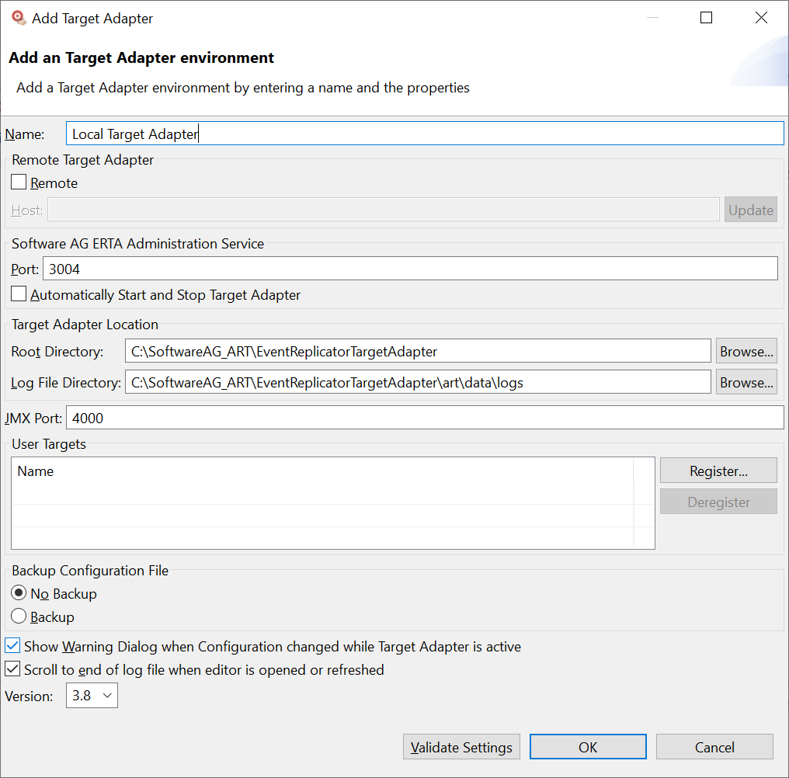

# User Targets

## What's a User Target
The *Event Replicator Target Adapter* replicates the data from Adabas on Mainframes to popular SQL databases (like Microsoft SQL Server, Oracle, DB2, etc.), Adabas, JMS, and some other systems. For most use cases, the existing targets are sufficient. However, it was hard to get scenarios to properly work in which targets were natively not supported by the *Event Replicator Target Adapter* or required another data format.

With User Targets, the user can extend the *Event Replicator Target Adapter* with seamlessly integrated custom targets. User Targets have the same look and feel as the predefined targets.

## How the User Target works
The *Event Replicator Server* writes the changes of the Adabas data to a messaging queue. This messaging queue is the source for the *Event Replicator Target Adapter*.

The data is processed by reading the replicated Adabas data, transforming the data, and sending the data to the target. When the target is a User Target, the processing is very similar, but instead of sending the data to the target, the *Event Replicator Target Adapter* passes the transformed data to the customized User Target, which is responsible for the further processing of the data. Depending on the operation in Adabas (insert, update or delete), different User Target methods are called.

## Requirements
User Targets are available as of *Event Replicator Target Adapter* version 3.7 and above. Implementation of User Targets must be in Java. The provided examples use Gradle to build the User Targets.

## Creating a User Targets
The *Event Replicator Target Adapter* requires User Targets to be a POJO (Plain Old Java Object). User Targets must implement a Java Interface with the name **IUserTarget**.

To ease the implementation, the abstract class **AbstractTarget** is available. If the User Target extends from this class, then only the required methods have to be overridden.

For details on how to create a User Target, check the Javadoc and the provided examples projects. 

### Constructor
During the instantiation of the User Target by the *Event Replicator Target Adapter*, the parameterless constructor is called.

### Parameter
User Targets may require additional parameters, for instance, a connection string to connect to a server or options that control the behavior of the User Target.

Parameter types:

* String - input field
* Number - input field that accepts only numeric values
* Boolean - check box
* File - file selection control
* Directory - directory selection control
* Group - parameter group
    
The *Event Replicator Target Adapter Administration* reads the parameter and creates an editor for the User Target. The editor allows for parameters to be entered.
The following is an example that shows all parameter types:
 

 
Like the regular targets, the User Targets parameters are stored in the context.xml that Event *Replicator Target Adapter* reads during startup.

With the method **getMetadata** the User Target parameters can be defined.

The parameters for the User Target that are set in the configuration file and read by the *Event Replicator Target Adapter* during startup are passed over to the User Target by the method **setParameter.**

### Properties
Properties are another option for User Target parameters that resemble tables.

The following is an example for a User Target with Properties:


These parameters are **not** stored in configuration files. Instead, they are written to a file in the directory located along with the User Target. The file extension is *.properties*. 
The User Targets have to read these properties files to access the values.
 
### Adabas events
The *Event Replicator Server* sends changes to the Adabas source data as events containing metadata and payload data to the *Event Replicator Target Adapter*. The metadata contains information concerning the transaction, i.e., file name, subscription, database number, file number, and operation.

#### Operations
Operations are the changes on the Adabas data sent to the Event Replicator Target Adapter. The different operations are
* insert - an Adabas record has been inserted
* update - an Adabas record has been updated
* delete - an Adabas record has been deleted
* populate - initial state data
* create - metadata information for the file sent during an initial state

For each operation, a method can be implemented to handle changes of the data on the target.

#### Data
Adabas data is wrapped in a class capable of handling the Adabas-specific field types, multiple fields, and periodic groups. The class is called **AdabasObject**.

The following is an example of an Adabas record represented as an **AdabasObject**:

```
 1 ISN {class java.lang.Long}: 593
 1 PERSONNEL_ID {class java.lang.String}: 20010600
 1 FIRST_NAME {class java.lang.String}: DAN
 1 MIDDLE_NAME {class java.lang.String}: M
 1 NAME {class java.lang.String}: HENRY
 1 MARSTAT {class java.lang.String}: M
 1 SEX {class java.lang.String}: M
 1 ADDRESS_LINE
 1   [0] {class java.lang.String}: 101 MARINE AVENUE
 1   [1] {class java.lang.String}: TULSA
 1   [2] {class java.lang.String}: OK
 1 CITY {class java.lang.String}: TULSA
 1 POSTCODE {class java.lang.String}: 74150
 1 COUNTRY {class java.lang.String}: USA
 1 AREACODE {class java.lang.String}: 918
 1 PHONE {class java.lang.String}: 703-4729
 1 DEPT {class java.lang.String}: TECH10
 1 JOBTITLE {class java.lang.String}: ANALYST
 1 INCOME[0]: 
  2 CURRCODE {class java.lang.String}: USD
  2 SALARY {class java.lang.Long}: 40000
 1 INCOME[1]: 
  2 CURRCODE {class java.lang.String}: USD
  2 SALARY {class java.lang.Long}: 36800
 1 INCOME[2]: 
  2 CURRCODE {class java.lang.String}: USD
  2 SALARY {class java.lang.Long}: 34200
 1 INCOME[3]: 
  2 CURRCODE {class java.lang.String}: USD
  2 SALARY {class java.lang.Long}: 32100
 1 INCOME[4]: 
  2 CURRCODE {class java.lang.String}: USD
  2 SALARY {class java.lang.Long}: 33440
 1 LEAVE_DUE {class java.lang.Short}: 26
 1 LEAVE_TAKEN {class java.lang.Short}: 4
 1 LEAVE_BOOKED[0]: 
  2 LEAVE_START {class java.lang.Integer}: 19980112
  2 LEAVE_END {class java.lang.Integer}: 19980112
 1 LEAVE_BOOKED[1]: 
  2 LEAVE_START {class java.lang.Integer}: 19980605
  2 LEAVE_END {class java.lang.Integer}: 19980607
 1 LEAVE_BOOKED[2]: 
  2 LEAVE_START {class java.lang.Integer}: 19980916
  2 LEAVE_END {class java.lang.Integer}: 19980918
 1 LANG
 1   [0] {class java.lang.String}: ENG
 1   [1] {class java.lang.String}: CHI
```

Regular Adabas fields are Java standard types (String, Integer, Short, Long, etc.) that correspond to the Adabas type and length. Multiple Fields (like ADDRESS_LINE) are arrays of Java standard types, and Periodic groups (like INCOME) are arrays of **AdabasObject**.

#### Transaction
Adabas operations are based on transactions, meaning that multiple operations (such as insert, update, delete) can be grouped into one transaction. At the end of a transaction, the **commit** method of the User Target is called.

#### Command
Some actions of the *Event Replicator Server*, such as refresh file or start server, are sent to the *Event Replicator Target Adapter Administration* as commands. These commands are propagated to the User Targets by the **command** method to perform required actions.

#### Status
During startup, the *Event Replicator Target Adapter* checks the status of the User Target by calling the method **isServiceOkay**. The result is printed as the **State** in the *sqlrep.log*.

### Close
When the *Event Replicator Target Adapter* has shut down, the **close** method of each User Target is called. It allows the User Targets to clean up, for instance, to disconnect the server connection properly.

### Icon
The User Targets can have an icon displayed in the tree-view and the editors. The icon must be in the *Portable Network Graphics (PNG)* or *Graphics Interchange (GIF)*-Format, with 16 by 16 size, have the same name as the User Target class, and be in the same directory as the User Target jar.

### Javadoc
The SDK Javadoc is available as a zip file in the doc folder.

## Installation
User Targets are installed from the *Event Replicator Target Adapter Administration*.
Start the *Event Replicator Target Adapter Administration* and select from the menu
Window > Preferences > Target Adapter.

*Note: The registered User Targets are environment-specific. If the User Target is required for multiple environments, it must be registered for each environment.*

Edit the Target Adapter to specify you want to add the User Targets:



Register the User Target by clicking on the Register button of the User Targets group, and selecting the User Target jar:


The classes that implement the **IUserTargets** interface are found and listed.

After saving the Target Adapter environment, the new registered User Target is available as Target:


All files required by the User Targets (User Target jar, dependent jars, images, etc.) must be in the same directory as the registered User Target jar. Otherwise, the *Event Replicator Target Adapter* may not find these files.
  
## Information at startup
The *Event Replicator Target Adapter* prints information on the User Targets during startup to the *sqlrep.log*:
```
ART0411I: User/Generic Target information at startup:

Type                 : Console Dump
Name                 : Dump
Description          : Dump
Version              : 3.7 [2021-06-17 12:03:18]
License Details
  Serial Number      : 0000000000
  License Key        : xxxxxxxxxxxxxxxxxxxxxxxxxxxxxxxx
  Customer ID        : ADA RnD - Test ARTUT
  Customer Name      : ADA RnD - Test ARTUT
  Operating System   : Linux S390,Linux,win
  Product Name       : Event Rep. Target Adapter for User Targ
  Product Code       : ARTUT
  Product Version    : 3.7
  Expiration Date    : 2021/12/31 (93 days remaining)
State                : Active
```

* Type - the type of the User Target, as listed in the *Administration* tree view
* Name - the name of the User Target's instance
* Description - description of User Target instance as entered in *Administration*
* License Details - information about the license
* Version - the version information derived from the *Bundle-Version* and the *Build-Date* of the **MANIFEST.MF** of the User Target jar
* State - the result of the **isServiceOkay** call

## Disclaimer
Utilities and samples shown here are not official parts of the Software AG products. These utilities and samples are not eligible for technical assistance through Software AG Global Support. Software AG makes no guarantees pertaining to the functionality, scalability , robustness, or degree of testing of these utilities and samples. Customers are strongly advised to consider these utilities and samples as "working examples" from which they should build and test their own solutions. 
